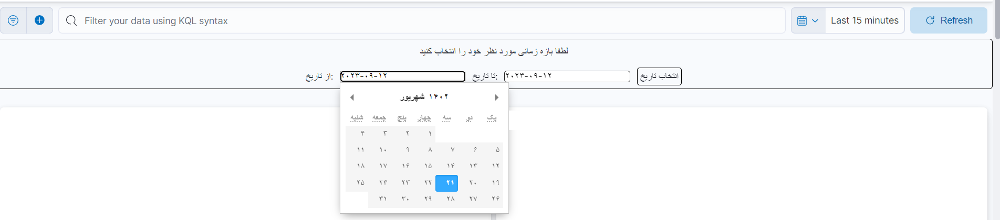

# Kibana Jalali Date Setter Extention

## Description

This is a Chromium browser extension designed to set the date range for a Kibana dashboard using the Jalali (Persian) calendar. This extension uses Moment.js, Moment-Jalali, and Pikaday-Jalali to manage date functionality. Users can also style the date picker with their own CSS.

[Download On Chrome web store](https://chromewebstore.google.com/detail/kibana-jalali-date-setter/hpoegiodadagdnelficfklmidgkcfemp)

## Prerequisites

- Chromium-based browser (Google Chrome, Brave, Microsoft Edge, etc.)
- Access to a Kibana dashboard

## Libraries Used

- [Moment.js](https://momentjs.com/)
- [Moment-Jalali](https://github.com/jalaali/moment-jalaali)
- [Pikaday-Jalali](https://github.com/TheServat/Pikaday-Jalali)

## Installation

1. Clone the repository to your local machine.
2. Open the Chromium browser and navigate to `chrome://extensions/`.
3. Enable 'Developer Mode' if it's not already enabled.
4. Click on the 'Load Unpacked' button and select the directory where you cloned the repository.

## Configuration

1. Open the `manifest.json` and `content.js` files.
2. Replace all instances of `your-domain.com` with your Kibana dashboard domain name.

## Custom Styling

To apply your own styles to the date picker, you can modify the `styles.css` file.

## Usage

1. Install and configure the extension.
2. Navigate to your Kibana dashboard.
3. You should see a new date picker panel at the top of the dashboard viewport.
4. Set your desired date range in the Jalali calendar.
5. Click on 'Set Date' to apply the new date range to your Kibana dashboard.

## License

This project is licensed under the GNU v3.0. See the [LICENSE](LICENSE) file for details.

## Contributing

Contributions are welcome! Create a new GitHub issue for bug reports, feature requests, or questions. Open a pull request to contribute improvements or fixes.

## Authors

[Mehran Goudarzi](https://github.com/your-github-username)
[Kooshan Ghelman](https://github.com/your-github-username)
